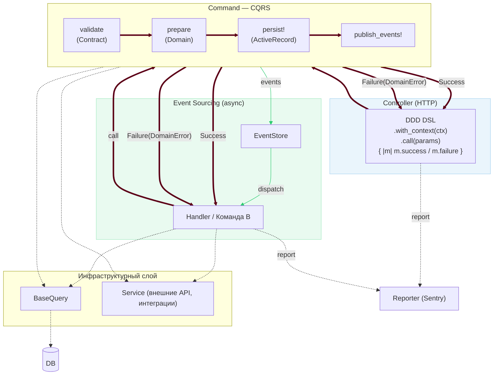
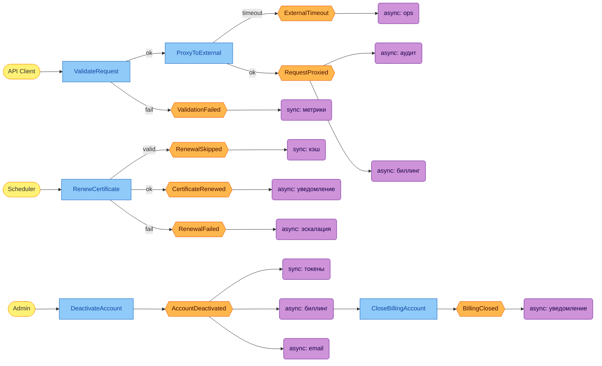

# Тезисы доклада для CFP

## Название

**"Древняя магия в повседневном коде: пять принципов функционального программирования в пяти языках"**

## Аннотация

Функциональное программирование — это не монады из учебника по Haskell. Это пять конкретных принципов, которые вы уже используете в production-коде, не подозревая об этом. Их общий знаменатель — **декларативность**: код описывает задачу, а не микроменеджит поток выполнения.

Доклад раскрывает фундаментальные свойства ФП через призму пяти языков с разной философией: OCaml (академическая чистота), Scala (JVM-прагматизм), Python (простота), JavaScript (вездесущность) и Rust (системная безопасность).

## Ключевые тезисы

### 1. Функции как значения — это не синтаксический сахар

- Почему замыкания в JavaScript — это не "хак", а фундаментальное свойство
- Как Python скрывает каррирование за декораторами
- Что Rust требует явно писать то, что OCaml делает по умолчанию

### 2. Ссылочная прозрачность: почему ваш код непредсказуем

- Разница между "работает" и "работает всегда одинаково"
- Как Scala балансирует между чистотой и реальностью JVM
- Почему в Python чистые функции — вопрос дисциплины, а в Rust — гарантия компилятора

### 3. Иммутабельность — это не про `const`

- Что значит "данные не меняются" в языках с GC и без
- Persistent data structures в OCaml vs structural sharing в JavaScript
- Как система владения Rust превращает иммутабельность в zero-cost abstraction

### 4. Декларативность: "что" вместо "как"

- От императивных циклов к `map`/`filter`/`reduce`
- Почему list comprehensions в Python — это не просто синтаксис
- Как pattern matching в Scala и Rust меняет подход к обработке данных
- Связь между декларативным стилем и читаемостью, тестируемостью кода и эффективностью компиляции

### 5. Выражения vs инструкции: когда `if` возвращает значение

- Почему в OCaml нет `return`
- Как тернарный оператор JavaScript стал основой функционального стиля
- Expression-oriented programming в Rust и statement-oriented в Python

## Практический выход

Участники получат:

- Сравнительную таблицу реализации ФП-принципов в пяти языках
- Понимание, какие ФП-паттерны применимы в их текущем стеке
- Как декларативный стиль влияет на качество программы и качество жизни разработчика
- Ответ на вопрос: "Нужно ли учить Haskell, чтобы писать функциональный код?"

**Спойлер:** Нет. Но понимание принципов улучшит код на любом языке.

## Технические детали

**Целевая аудитория:** Middle/Senior разработчики, использующие хотя бы один из рассмотренных языков

**Формат:** 40-45 минут, код на слайдах, живые примеры

**Уровень:** Intermediate — предполагается знание базового синтаксиса языков

## Рассматриваемые языки

1. **OCaml** — эталон ML-семейства, академическая строгость
2. **Scala** — баланс ФП и ООП на JVM
3. **Python** — простота и прагматизм
4. **JavaScript** — вездесущность и функции первого класса
5. **Rust** — системное программирование с ФП-гарантиями

## Структура доклада

### Введение (5 мин)

- Провокационный тезис: вы уже пишете функциональный код
- Пять фундаментальных свойств ФП, декларативный стиль как ключ к пониманию (* ии-кодинг был изобретен до LLM)
- Почему именно эти пять языков

### Основная часть (30 мин)

По 6 минут на каждое фундаментальное свойство:

1. Определение свойства
2. Живой код на всех пяти языках
3. Сравнение подходов
4. Практические следствия

### Заключение (5-10 мин)

- Сводная таблица
- Когда какой язык выбрать
- Q&A

## Бонус-трек: ФП в production DDD-приложении (Ruby)

### Контекст

Production-система на Ruby: телеком-домен, сложная бизнес-логика, NDA. Технический стек: Rails + dry-rb (monads, validation, types, initializer). Архитектура: DDD с командами, доменными ошибками, контрактами и событиями.

Это не академический пример — это конкретная кодовая база с реальными trade-off'ами.

### Архитектура фреймворка

Система разбита на слои с явными границами ответственности:



Ключевые dry-rb компоненты:

| Слой      | Библиотека                            | Роль                              |
|-----------|---------------------------------------|-----------------------------------|
| Типы      | `dry-types`, `dry-initializer`        | Value objects, нормализация       |
| Валидация | `dry-validation`                      | Контракты на входе команды        |
| Монады    | `dry-monads` (Result, Maybe, Try, Do) | ROP, быстрый отбой                |
| Матчер    | `dry-matcher`                         | Pattern matching на результате    |
| DI        | `dry-container`, `dry-auto_inject`    | Репортер, внешние зависимости     |

### Event Storming: абстрактный сценарий

Схема в нотации event storming для типовых flow (конкретный домен скрыт под NDA). Прямоугольники — команды, шестиугольники — доменные события, скруглённые — обработчики:



Каждое событие — `Class.new(DomainEvent)`, каждый обработчик — `Sidekiq::Worker`. Политика `sync:` / `async:` задаётся в диспетчере через `handler Klass, sync: true`.

Связи "Command → Event → Handler" явны в коде и не размазаны по callbacks или `after_commit`.

### 1. ROP в команде: три фазы как три рельса

Каждая команда — конвейер с явными точками отказа:

```ruby
def call(raw_input = {})
  @context_result
    .bind { do_validate(raw_input) }          # Failure → быстрый отбой
    .bind { |input| do_prepare(**input) }
    .bind { |input| do_persist!(**input) }
    .bind { |result| publish_events!(result) }
end
```

Три свойства ФП в одной строке: **функции как значения** (bind принимает лямбду), **декларативность** ("что" делаем, не "как"), **выражения** (каждый bind возвращает новый Result).

Если `do_validate` вернул `Failure` — `do_persist!` никогда не вызовется. Это не `if`, не `rescue` — это выполнение как
логическая структура. Каждая строка конвейера соответствует шагу бизнес-логики. Код "рассказывает историю", а не микроменеджит выполнение.

### 2. Do-нотация: монады с человеческим лицом

```ruby
include Dry::Monads::Do.for(:load_entity)

def load_entity(id:)
  owner  = yield find_owner(id)          # Success → продолжаем
  config = yield load_config(owner)      # Failure → выходим немедленно
  state  = yield resolve_state(config)

  Success(owner:, config:, state:)
end
```

`yield` здесь не Ruby-блок — это связывание в монаде. Обработка ошибок скрыта в монаде; основной поток описывает только happy path. Это аналог `do`-нотации Haskell для монады `Either`.

### 3. Типовые контракты: невалидные состояния невозможны

```ruby
module DomainTypes
  DownCasedString = Types::String.constructor { |v| v&.downcase }
  Email           = DownCasedString.constrained(format: EMAIL_REGEXP)
  Uuid            = StrippedString.constrained(format: UUID_REGEXP)

  module HttpTypes
    Method     = Types::String.enum(*%w[GET POST PUT PATCH DELETE])
    SafeMethod = Types::String.enum(*%w[GET HEAD OPTIONS])
  end
end
```

Тип `Email` не просто проверяет — он **нормализует** при создании. `HttpTypes::SafeMethod` физически не пропускает
`POST`. Это **иммутабельность** данных через систему типов: невалидный объект не может попасть в систему в принципе.

Нестандартный пример: тип `Base64JsonHash` — декодирует и парсит JSON внутри конструктора типа:

```ruby
Base64JsonHash = Hash.constructor do |value|
  Try[JSON::ParserError, ArgumentError] {
    JSON.parse(Base64.decode64(value.to_s), symbolize_names: true)
  }.value_or(nil)
end
```

### 4. Доменные ошибки как значения

```ruby
class DomainError
  extend Dry::Initializer

  option :field, optional: true
  option :meta,  optional: true

  def to_monad = Dry::Monads::Failure(self)
  def details   = self.class.dry_initializer.public_attributes(self)
end

# Конкретная ошибка домена — это тип, а не строка
ExternalApiError = Class.new(DomainError) do
  option :path
  option :error_type  # :timeout | :connection_failed | :http_error
  option :http_status # 502 | 504
end
```

Ошибка — **значение определенного типа**, а не исключение. `error_type: :timeout` vs `error_type: :connection_failed`
подразумевают разные retry-стратегии. `http_status` — разные коды ответа. Всё кодируется в описании структуры, а не в
условных операторах.

### 5. Бизнес-DSL: pattern matching на результатах

```ruby
MATCHER = DomainFailureMatcher.define_matcher

MATCHER.call(command.call(params)) do |m|
  m.success                   { |result| render_ok(result) }
  m.failure(ExternalApiError) { |e| render_proxy_error(e) }
  m.failure(ContractError)    { |e| render_validation(e) }
  m.failure                   { |e| render_unexpected(e) }
end
```

Обработка результатов декларативна. Читается как контракт: при успехе — одно, при каждом типе ошибки — своё. Нет
вложенных `if/elsif/rescue`. Добавление нового типа ошибки — одна строка в истории, а не расползание ветвлений по коду.

### Итог: зачем это в докладе

Синтез всех пяти принципов из основной части:

| Принцип                | Где проявляется                           |
|------------------------|-------------------------------------------|
| Функции как значения   | `.bind`, лямбды в обработчике результатов |
| Ссылочная прозрачность | Команды без глобального состояния         |
| Иммутабельность        | Type constructors, `Dry::Struct`          |
| Декларативность        | Contract DSL, Result pipeline             |
| Выражения              | Каждый `bind` возвращает значение         |

**Аудитории:** показывает применимость ФП-принципов в production Ruby-коде на реальной бизнес-задаче.

---

## Опорные материалы

- Полный обзор: [fp_languages_review.md](fp_languages_review.md)
- 11 языков в оригинальном исследовании
- Примеры кода на каждом языке
