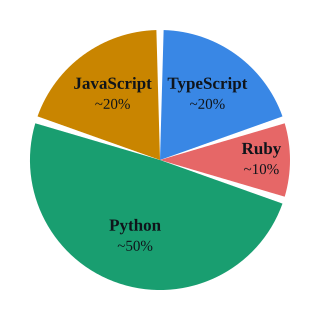
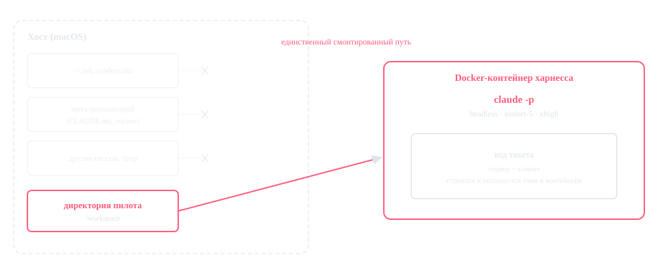
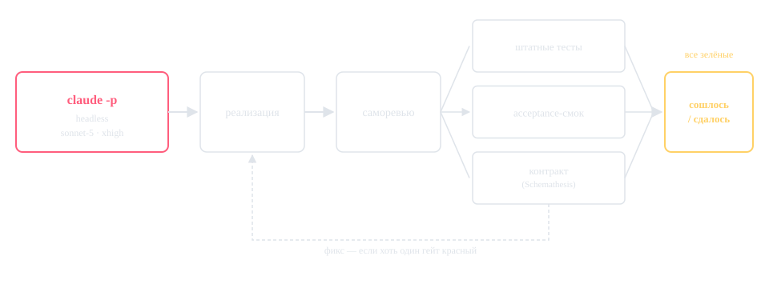

<!-- _class: lead -->
<!-- _paginate: false -->

# На вкус и цвет все фломастеры разные

<span class="subtitle">Особенно если вы пишете на Ruby</span>

<span class="subtitle">Павел Аргентов · RubyRussia 2026</span>

<!--
Каркас презентации. Наполнение секций — по docs/TALK-OUTLINE-rubyrussia-2026.md
из репозитория эксперимента (llm-lang-experiment). Здесь только структура и опорные
цифры, прозаический текст дописывается отдельно.
-->

---

## План

<!-- План презентации заполняем ad hoc -->

---

<!-- _class: section -->

# Раздал тараканам мелки: сидят рисуют

---

## Сценарий из турецкого офисного сериала (нет)

- Агент на Ruby-проекте: ходит по кругу и пишет ересь.
- Коллега на Python в соцсети: — А я уже ...

---

<!-- _class: section -->

# WTF

---

## Собака-подозревака.jpg

Агент пристрастен к языку из-за объёма его кода в обучающей выборке модели.

<div class="pie-wrap">



<ul class="pie-legend">
<li><span class="swatch" style="background:#199e70"></span> <strong>Python</strong> — язык авторов LLM</li>
<li><span class="swatch" style="background:#c98500"></span> <strong>JavaScript</strong> — массовость</li>
<li><span class="swatch" style="background:#3987e5"></span> <strong>TypeScript</strong> — тот же JS</li>
<li><span class="swatch" style="background:#e66767"></span> <strong>Ruby</strong> — <span style="color:#dc143c; font-weight:700">МЁРТВ</span></li>
</ul>

</div>

---

<!-- _class: section -->

# Дизайн эксперимента

---

## Подопытные

<div class="lang-grid">
<div class="lang-card" style="--lc:#199e70"><span class="lc-name">Python</span></div>
<div class="lang-card" style="--lc:#c98500"><span class="lc-name">JavaScript</span></div>
<div class="lang-card" style="--lc:#3987e5"><span class="lc-name">TypeScript</span></div>
<div class="lang-card" style="--lc:#e66767"><span class="lc-name">Ruby</span></div>
</div>

<div class="invariants">
<div><strong>Харнесс</strong>Claude Code, headless (<code>claude -p</code>)</div>
<div><strong>Модель</strong><code>claude-sonnet-5</code>, точным ID на каждом вызове</div>
<div><strong>Effort</strong><code>xhigh</code>, явно на каждом вызове</div>
<div><strong>Переменная</strong>только язык проекта — всё остальное держим постоянным</div>
</div>

---

## Устройство харнесса

<figure class="cycle-figure">

<figcaption>
<ul>
<li>Изоляция агента на уровне ОС</li>
<li>Если путь не примонтирован — его физически нет в файловой системе процесса агента</li>
</ul>
</figcaption>
</figure>

---

## Как устроен цикл

<figure class="cycle-figure">

<figcaption>
<ul>
<li>Один и тот же цикл на всех языках</li>
<li>Три гейта — часть критерия «сошлось / упало»</li>
<li>На тикет фиксируются <strong>итерации</strong>, <strong>время</strong> и <strong>токены</strong> — точными полями из JSON-вывода харнесса</li>
</ul>
</figcaption>
</figure>

---

## Задача: Syncbox

- Файловое хранилище с синхронизацией
- HTTP-сервер + CLI-клиент
- Единая спецификация, с нуля на каждом языке

<div class="columns">

<div>

**Жёсткие требования**

- HTTP API: `/blobs/{key}`, `/blobs`, `/healthz`
- CLI: `push` / `pull` / `sync` / `status`, имена флагов
- Правило разрешения конфликтов в `sync`
- Тесты

</div>

<div>

**На усмотрение «разработчика»**

- Библиотеки, HTTP-фреймворк, тест-фреймворк
- Формат хранения метаданных на диске
- Модель параллелизма

</div>

</div>

---

## Syncbox, ожидаемое поведение

```sh
$ run-server --data-dir ./data --port 8080
[слушает :8080]

$ run-client push ./notes --server http://localhost:8080
notes/todo.txt    201 Created   sha256=1a2b3c…

$ run-client sync ./notes --server http://localhost:8080
notes/plan.md     ← pulled (новее на сервере)
notes/todo.txt    up to date
```

- `run-server` / `run-client` — обязательная конвенция запуска
- `push` / `pull` — односторонне, отправка и получение
- `sync` — двунаправленно, конфликт решает более свежий `mtime`

---

## Репозиторий

<div class="qr-wrap">


<div class="qr-caption">
<span class="placeholder-tag">плейсхолдер</span><br>
Репозиторий Syncbox на GitHub — ссылка и QR появятся ближе к докладу,
когда репозиторий станет публичным.
</div>

</div>

---

<!-- _class: section -->

# Честный стенд оказался труднее эксперимента

---

## Как мы ловили сами себя

<div class="columns">

<div>

**Что пробовали**

- Файловая песочница через `--settings`
- Docker-обёртка вокруг вызова
- Проброшенный сокет Docker (DooD)

</div>

<div>

**Где протекло**

- Песочница держала только Bash, не Read/Write
- Сокет давал примонтировать любой хостовый путь
- Итог — Docker-in-Docker: хостовой ФС в принципе нет

</div>

</div>

<p class="note">Главный эпизод: Python, тикет 1 — агент нашёл эталонную реализацию через Bash+Read и почти дословно скопировал. Воспроизводилось на 100 %.</p>

---

<!-- _class: section -->

# Первые наблюдения

---

## Пилотная фаза — это не выводы

**`n = 1` на ячейку.** 44 прогона: 4 языка × 11 тикетов.
Статистический тест на таких объёмах не осмыслен.

---

## Что показал пилот

- По бинарному «агент справился» **эффекта языка нет**: 4/4 языка на 11/11 тикетов сошлись
- Цена успеха: Ruby **не дороже**, чем {Python ≈ JavaScript}, дальше TypeScript
- Анекдотический «Ruby хуже всех» **не воспроизвёлся** — под единой методикой Ruby самый дешёвый по деньгам и out-токенам
- Единственный Ruby-сигнал: медленный по календарю, но **не по времени модели** — разницу даёт работа вокруг модели (тесты, пересборка): ~21 мин против ~7 у Python

---

## TypeScript и гипотеза

- TypeScript дороже всех — согласуется с тем, что его корпус в разы тоньше
- Гипотеза объединяла JS и TS в один «массовый» механизм — данные их разводят
- Риск циркулярности: если ИИ-тулинг разгоняет внедрение TypeScript,
  то «TS массовый» и «модель любит TS» перестают быть независимыми

---

<!-- _class: section -->

# Что это значит и что дальше

---

## Честный заголовок на сегодня

Чистое измерение пока **не показывает** того, что предсказывали анекдоты, при `n = 1`.
Это не «гипотеза опровергнута» и не «Ruby в порядке, расходимся».

**Осталось незакрытым:**

- `n = 1` → нужен полный прогон (10–100 тикетов на язык)
- Цена и скорость — косвенный прокси, не прямая проверка гипотезы
- Гейт `smoke` гнался в режиме `info`, не `block`

---

<!-- _class: section -->

# Выводы для зала

---

## Конфаундеры

- Разные проекты на разных языках несопоставимы по масштабу — разницу спишут на проект
- **Утечка обучающих данных**: модель могла запомнить фиксы к issue популярного репозитория
- Разные ассистенты и инструменты — разное поведение, не связанное с языком
- **Оператор и дрейф методики** — именно этот конфаундер нас потом и укусит

Тот самый стенд, где язык — единственная переменная, был нужен ровно поэтому.

---

## Выводы для зала

- Буксует агент на Ruby — прежде чем винить язык, посмотрите на свой цикл:
  сколько уходит на модель, сколько на пересборку и тесты между итерациями
- «Python-коллега, у которого всё просто работает» — возможно, меряет не язык, а свой стенд
- Единственный барьер, который агент не обходит изнутри, — внешняя изоляция уровня ядра ОС
- Доверяйте методике, а не первому прогону — особенно если он подтверждает то, что вы и так думали

---

<!-- _class: lead -->

# Спасибо

<span class="subtitle">Вопросы</span>


