<!-- _class: lead -->
<!-- _paginate: false -->

# На вкус и цвет все фломастеры разные

<span class="subtitle">Особенно если вы пишете на Ruby</span>

<span class="subtitle">Павел Аргентов · RubyRussia 2026</span>

<!--
Каркас презентации. Наполнение секций — по docs/TALK-OUTLINE-rubyrussia-2026.md
из репозитория эксперимента (llm-lang-experiment). Здесь только структура и опорные
цифры, прозаический текст дописывается отдельно.
-->

---

<!-- _class: plan -->

## Как я провёл...

1. Что?
2. Ай дид май овн рисёрч
3. Эксперимент
4. Гладко было на бумаге...
5. Первые наблюдения
6. Обзор на обзор на эксперимент
7. В заключение

---

<!-- _class: section -->

# Что?

---

## Условия работы

- Аутстафф. Клиенты меняются
- Обычная задача — доработать или переработать чужой код (писал человек или машина)
- Язык может быть любым

---

<!-- _class: quote -->

Машина пишет код, а человек получает...

---

## Типичный сценарий

- Задача — доработать или переработать (иногда и с нуля написать)
- Код чужой, на произвольном языке
- Нужно на ходу оценить, насколько AI-агент «вывозит» этот язык
- Если модель плохо справляется, приходится компенсировать руками

---

<!-- _class: section -->

# Ай дид май овн рисёрч

---

## Гипотеза

Агент пристрастен к языку из-за объёма его кода в обучающей выборке модели.

<div class="pie-wrap">

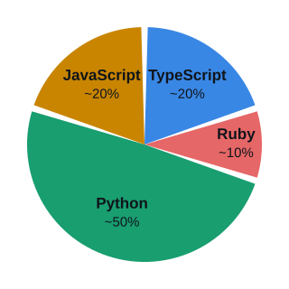

<ul class="pie-legend">
<li><span class="swatch" style="background:#199e70"></span> <strong>Python</strong> — язык авторов LLM</li>
<li><span class="swatch" style="background:#c98500"></span> <strong>JavaScript</strong> — массовость</li>
<li><span class="swatch" style="background:#3987e5"></span> <strong>TypeScript</strong> — тот же JS</li>
<li><span class="swatch" style="background:#e66767"></span> <strong>Ruby</strong> — <span style="color:#dc143c; font-weight:700">МЁРТВ</span></li>
</ul>

</div>

---

<!-- _class: section -->

# Эксперимент

---

## Подопытные

<div class="lang-grid">
<div class="lang-card" style="--lc:#199e70"><span class="lc-name">Python</span></div>
<div class="lang-card" style="--lc:#c98500"><span class="lc-name">JavaScript</span></div>
<div class="lang-card" style="--lc:#3987e5"><span class="lc-name">TypeScript</span></div>
<div class="lang-card" style="--lc:#e66767"><span class="lc-name">Ruby</span></div>
</div>

<div class="invariants">
<div><strong>Харнесс</strong>Claude Code, headless (<code>claude -p</code>)</div>
<div><strong>Модель</strong><code>claude-sonnet-5</code>, точным ID на каждом вызове</div>
<div><strong>Effort</strong><code>xhigh</code>, явно на каждом вызове</div>
<div><strong>Переменная</strong>только язык проекта — всё остальное держим постоянным</div>
</div>

---

## Установка

<figure class="cycle-figure">
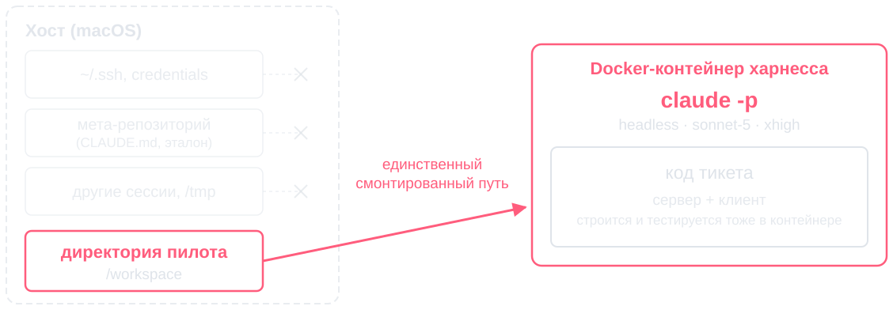
<figcaption>
<ul>
<li>Изоляция агента на уровне ОС</li>
<li>Если путь не примонтирован — его физически нет в файловой системе процесса агента</li>
</ul>
</figcaption>
</figure>

---

## Процесс

<figure class="cycle-figure">
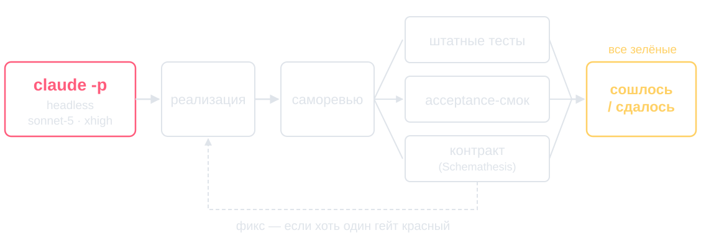
<figcaption>
<ul>
<li>Один и тот же цикл на всех языках</li>
<li>Три гейта — часть критерия «сошлось / упало»</li>
<li>На тикет фиксируются <strong>итерации</strong>, <strong>время</strong> и <strong>токены</strong> — точными полями из JSON-вывода харнесса</li>
</ul>
</figcaption>
</figure>

---

## Гейты

| Гейт               | Что проверяет                           | Режим   |
| ------------------ | --------------------------------------- | ------- |
| `run-tests`        | штатные тесты (пишет проверяемый агент) | `block` |
| `contract-test.sh` | Schemathesis по OpenAPI                 | `block` |
| `smoke.sh`         | чёрный ящик по HTTP/CLI                 | `info`  |

<p class="note">При падении блокирующего гейта харнесс сам строит «симптом» для следующего вызова <code>claude -p</code> — без путей хоста и имён acceptance-скриптов, до сходимости или <code>--max-iters</code> (по умолчанию 4).</p>

---

## Тестовая задача: Syncbox

- Файловое хранилище с синхронизацией
- HTTP-сервер + CLI-клиент
- Единая спецификация, с нуля на каждом языке

<div class="columns">

<div>

**Жёсткие требования**

- HTTP API: `/blobs/{key}`, `/blobs`, `/healthz`
- CLI: `push` / `pull` / `sync` / `status`, имена флагов
- Правило разрешения конфликтов в `sync`
- Тесты

</div>

<div>

**На усмотрение «разработчика»**

- Библиотеки, HTTP-фреймворк, тест-фреймворк
- Формат хранения метаданных на диске
- Модель параллелизма

</div>

</div>

---

## Syncbox, ожидаемое поведение

```sh
$ run-server --data-dir ./data --port 8080
[слушает :8080]

$ run-client push ./notes --server http://localhost:8080
notes/todo.txt    201 Created   sha256=1a2b3c…

$ run-client sync ./notes --server http://localhost:8080
notes/plan.md     ← pulled (новее на сервере)
notes/todo.txt    up to date
```

- `run-server` / `run-client` — обязательная конвенция запуска
- `push` / `pull` — односторонне, отправка и получение
- `sync` — двунаправленно, конфликт решает более свежий `mtime`

---

## Репозиторий

<div class="qr-wrap">


<div class="qr-caption">
Репозиторий эксперимента на GitHub<br>
<strong>github.com/argent-smith/llm-lang-experiment</strong>
</div>

</div>

---

<!-- _class: section -->

# Гладко было на бумаге...

---

## Раунд 1: агент нашел эталонную реализацию

<div class="columns">

<div>

**Обнаружено**

- Тикет 1, Python — первый реальный прогон пилота
- Агент нашёл эталонную реализацию в мета-репозитории обычными Bash и Read
- Скопировал почти дословно — воспроизводилось на 100 %

</div>

<div>

**Фикс**

- `SYNCBOX-SPEC.md` больше не называет и не описывает пути внутри мета-репозитория
- Файловая песочница `denyRead`/`allowRead` через `--settings`

</div>

</div>

---

## Раунд 2: агент снова все нашел

<div class="columns">

<div>

**Обнаружено**

- Аудит: агент опять все нашел и списал
- Песочница раунда 1 ограничивала только Bash-подпроцессы
- Инструменты Read и Write агента её не соблюдали вообще

</div>

<div>

**Фикс**

- Весь вызов `claude -p` обёрнут в Docker-контейнер
- С хоста в него примонтирована только директория пилота

</div>

</div>

<p class="note">Агент умный и находит любые обходные пути</p>

---

## Раунд 3: угадайте, что...

<div class="columns">

<div>

**Обнаружено**

- Тикет 9, Ruby
- Через проброшенный хостовый сокет Docker (DooD) агент мог примонтировать любой хостовый путь
- `run-client status /tmp` обошёл весь хостовый `/private/tmp`

</div>

<div>

**Фикс**

- Переход на Docker-in-Docker
- У внутреннего `dockerd` хостовой файловой системы в принципе нет

</div>

</div>

<p class="note">Агент «под пытками» сам во всём сознался и всё починил.</p>

---

<!-- _class: quote -->

Плохо сколоченный стенд измеряет себя, \
а не объект

---

<!-- _class: section -->

# Первые наблюдения

---

## Пилотная фаза — проверка состоятельности опыта

- **Ячейка** — пара «язык × тикет»: 4 языка × 11 тикетов = 44 ячейки.
- Выборка **`n = 1`** на ячейку
- Типичный случай не-статистики.

---

## Не упал никто

<figure class="cycle-figure">
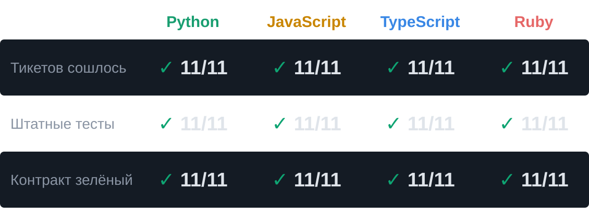
<figcaption>По бинарной метрике «агент справился» языкового эффекта нет — различие целиком в цене успеха.</figcaption>
</figure>

---

## Итого по языку

<figure class="cycle-figure">
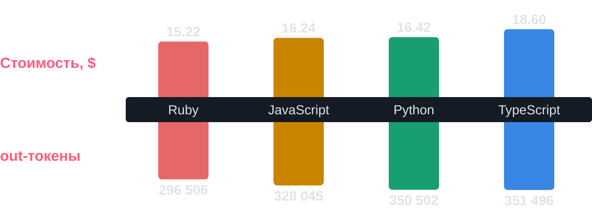
<figcaption>44 канонических прогона: тикеты 1–11 × 4 языка</figcaption>
</figure>

---

## Как считается ранг: на тикете

<figure class="cycle-figure">
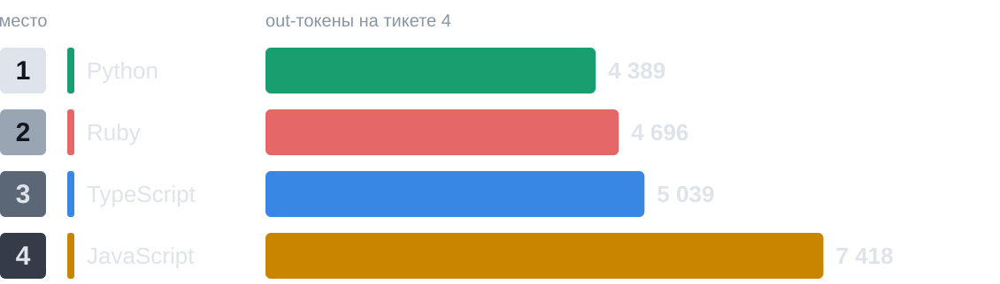
<figcaption>Тикет 4, out-токены: языки выстраиваются от меньшего значения к большему. Место 1 — потратил меньше всех, место 4 — больше всех.</figcaption>
</figure>

---

## Как считается ранг: в сумме

<figure class="cycle-figure">
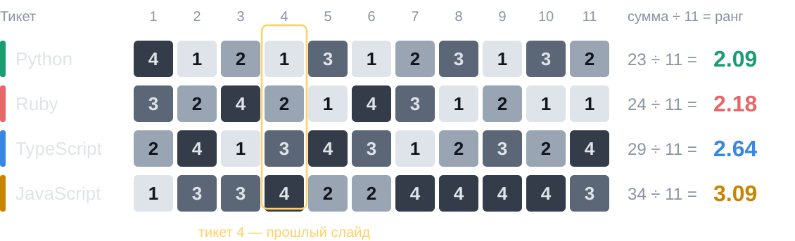
<figcaption>Так — на каждом из 11 тикетов. Ранг — среднее место (сумма ÷ 11); эти четыре числа — столбцы следующего слайда. Так же считаются ранги по числу ходов и по времени.</figcaption>
</figure>

---

## Ранги по тикетам

<figure class="cycle-figure">
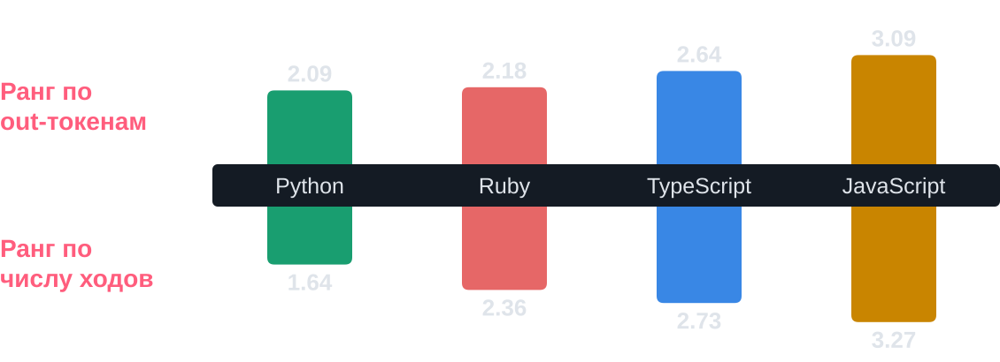
<figcaption>Ранг 1 — дешевле/меньше всех на тикете, 4 — дороже/больше всех; среднее по 11 тикетам, снимает разброс размера тикетов. Сортировка от лучшего к худшему.</figcaption>
</figure>

---

## Ранги по времени

<figure class="cycle-figure">
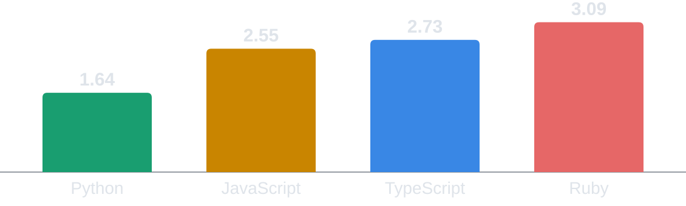
<figcaption>Ранг 1 — быстрее всех на тикете, 4 — медленнее всех; среднее по 11 тикетам, время — весь прогон целиком. Сортировка от лучшего к худшему.</figcaption>
</figure>

---

## Ruby: разбор полётов

- Тезис «Модели знают Ruby хуже всего» **не воспроизвёлся** — под единой методикой Ruby самый дешёвый по деньгам и out-токенам
- «Какое время и какие деньги»: Ruby **не дороже**, чем {Python ≈ JavaScript}, не говоря уже о TypeScript
- Единственный Ruby-дроубэк: медленный «по календарю», но **не по времени модели** — разницу даёт работа вокруг модели: ~21 мин против ~7 у Python

---

## Ruby: почему так медленно?

<figure class="cycle-figure">
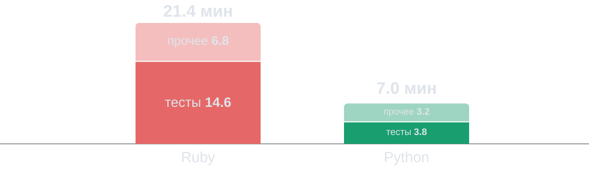
<figcaption>Минуты work-времени, сумма по 11 каноническим тикетам</figcaption>
</figure>

---

## Ruby: что внутри «тестов»

<figure class="cycle-figure">
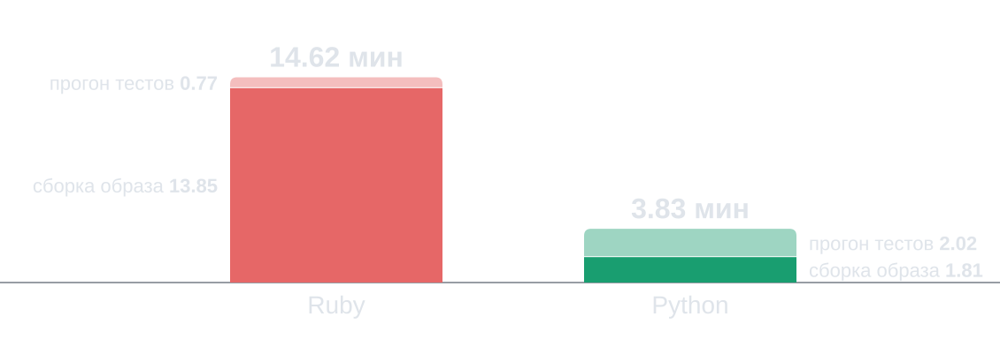
<figcaption>Минуты в вызовах <code>run-tests</code> — сегмент «тесты» с прошлого слайда, сумма по 11 каноническим тикетам. Сборка образа — по логу BuildKit внутри вызова; пересборка — следствие выбора образа агентом, см. ниже.</figcaption>
</figure>

---

## Улика: один и тот же вызов

<figure class="cycle-figure">
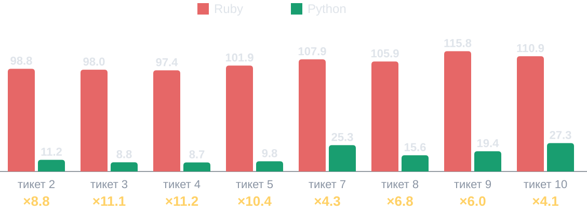
<figcaption>Первый <code>./run-tests</code> в одном и том же тикете, секунды; ×N — во сколько раз Ruby дольше. У Ruby ~95 % вызова — сборка образа по логу BuildKit, не тесты. Тикеты 1, 6, 11 не показаны: там сборка у Ruby шла не через <code>run-tests</code>.</figcaption>
</figure>

---

## Ruby: причина — выбор образа, не язык

<div class="columns">

<div>

**Ruby:** `FROM ruby:3.3`

- образа нет в харнессе — заранее загружен только `ruby:3.3-slim`
- скачивание ≈ 75–90 с
- `bundle install` ≈ 17–27 с

</div>

<div>

**Python:** `FROM python:3.12-slim`

- образ заранее загружен в харнесс
- `pip install` ≈ 9 с

</div>

</div>

- **Образ выбрал сам агент**: `FROM ruby:3.3` на тикете 1, дальше все 11 тикетов его унаследовали; до 4 сентября тот же агент писал `ruby:3.3-slim`
- `run-tests` у обоих — `docker compose run tests`: образ собирается в первом вызове, демон пуст на старте прогона
- Спецификация об образах молчит — агенту о заранее загруженных не сообщали

---

## Ruby: что тормозило кроме тестов?

<figure class="cycle-figure">
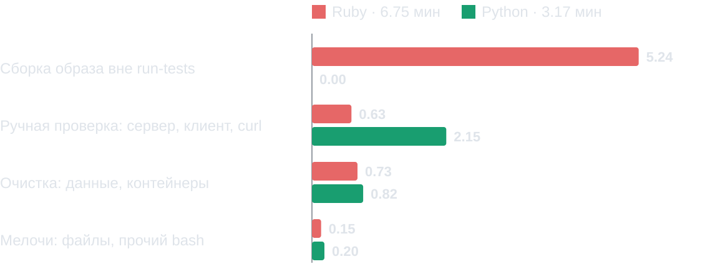
<figcaption>Минуты work-времени вне вызовов <code>run-tests</code>, сумма по 11 каноническим тикетам. Сборка образа вне <code>run-tests</code> — та же холодная сборка: вместе с 13.85 мин внутри вызовов это 19.09 мин, около 90 % work-времени Ruby.</figcaption>
</figure>

---

## Вторая аномалия: TypeScript

<div class="pie-pair">

<figure>
<figcaption>Ожидание</figcaption>

</figure>

<figure>
<figcaption>Реальность</figcaption>
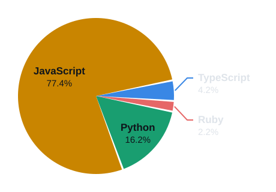
</figure>

</div>

<p class="source">Реальное — по The Stack v2 (BigCode), открытому корпусу исходного кода. Доли — среди этих четырёх языков. Состав обучающих данных Claude не раскрыт; открытый корпус — лучшая публичная оценка пропорций языков. <strong>arXiv:2402.19173</strong>, табл. 1.</p>

---

## Реальный объём кода в корпусе

<figure class="cycle-figure">
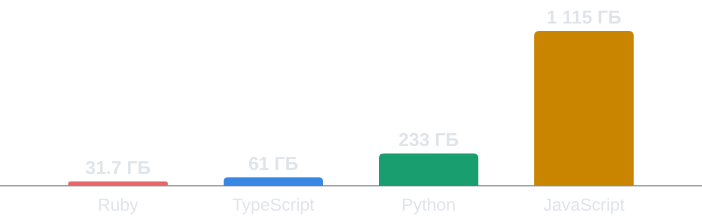
<figcaption>Ruby — вдвое меньше TypeScript и в 35 раз меньше JavaScript.</figcaption>
</figure>

<p class="source">The Stack v2 (BigCode), открытый корпус исходного кода: объём в ГБ; копии одного и того же кода (почти одинаковые файлы) посчитаны один раз. Состав обучающих данных Claude не раскрыт; открытый корпус — лучшая публичная оценка пропорций языков. <strong>arXiv:2402.19173</strong>, табл. 1.</p>

---

## TypeScript: объяснительная записка

- TypeScript дороже всех — согласуется с тем, что его корпус в разы тоньше
- Гипотеза объединяла JS и TS в один «массовый» механизм — данные их разводят

---

<!-- _class: section -->

# Обзор на обзор на эксперимент

---

## Current status

- Готов стенд
- Готов счетный аппарат
- Есть **пробные** данные

**Осталось незакрытым:**

- `n = 1` → нужен полный прогон (~100 тикетов на язык)
- Цена и скорость — косвенный прокси, **не анализ качества**

---

<!-- _class: section -->

# В заключение

---

## Что мешает объективной оценке

- Разные проекты на разных языках не эквивалентны по масштабу
- **Локальные утечки**: модель может находить и использовать накопленный опыт в локально доступных проектах
- Разные ассистенты и инструменты — разное поведение, не связанное с языком

---

## Практический выхлоп

- Буксует агент на Ruby — прежде чем винить язык, проверьте инструменты
- «Довольный сосед с Python» — возможно, меряет не язык, а свой стенд
- Единственный барьер, который агент не обходит изнутри, — внешняя изоляция уровня ядра ОС
- При исследовании полагайтесь на корректную методику, а не ожидаемые данные

---

<!-- _class: lead -->

# Спасибо

<span class="subtitle">Для творческих фидбеков</span>

<div class="qr-pair">

<figure>

<figcaption>Обратная связь по докладу</figcaption>
</figure>

<figure>

<figcaption>Слайды доклада</figcaption>
</figure>

</div>
